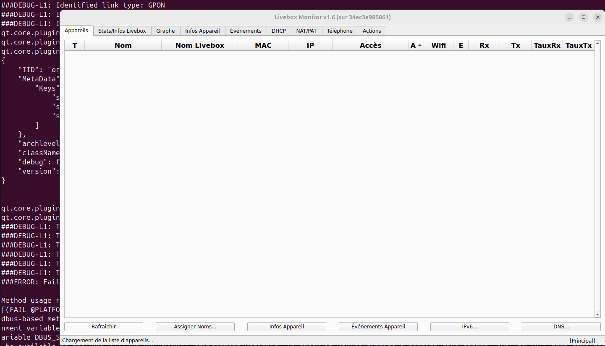

Simple petit projet qui permet de lancer LiveboxMonitor (https://github.com/p-dor/LiveboxMonitor) dans un conteneur docker.

Je l'utilise pour le lancer en local sous Linux, depuis une Ubuntu 24.04

Etape 1 : Construire l'image docker en local (prend la dernière version de LiveboxMonitor présente au moment du build) : 
```
docker build -t liveboxmonitor .
```

Etape 2 : 1er lancement du conteneur ainsi fabriqué : 
```
docker run -it \
    -v /tmp/.X11-unix:/tmp/.X11-unix \
    -e DISPLAY=$DISPLAY \
    -u qtuser \
    -t liveboxmonitor \
    liveboxmonitor
```

Etape 3 : lancements ultérieurs en gardant le contexte (mot de passe, etc) :
```
docker run -t liveboxmonitor
```

Et voilà :)




Merci à p-dor pour le très bon projet LiveboxMonitor qui est bien mieux que l'interface native de la livebox !
